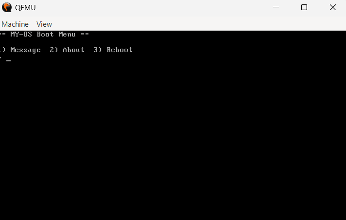

# x86 Bootloader

A boot sector written in raw x86 assembly that runs directly on bare metal
(or QEMU) — no operating system, no C runtime, no libraries. Just 512 bytes
handed off by the BIOS.



## What's here

| File          | What it does                                                       |
|---------------|---------------------------------------------------------------------|
| `01_hello.asm`| Minimal boot sector — prints `Hello, World!` and halts             |
| `02_menu.asm` | Interactive text menu with keyboard input and a reboot option      |

Both assemble to exactly 512 bytes and end with the mandatory `0x55AA`
boot signature, which is what tells the BIOS "this disk is bootable."

## How it works

When a PC powers on, the BIOS runs POST, picks a boot device, loads the
first 512-byte sector of that device into memory at address `0x7C00`,
and jumps to it — in 16-bit real mode, with no OS, no memory protection,
and no C library. Everything from that point on is on you.

This project uses:
- **Real mode addressing** and manual segment register setup
- **BIOS interrupts** for I/O — `int 0x10` (video teletype / mode set)
  and `int 0x16` (keyboard input), since there's no OS to provide drivers
- A **dispatch loop** that reads a keypress and jumps to the matching
  menu option
- A **keyboard-controller reset trick** (`out 0x64, 0xFE`) to reboot the
  machine from the "Reboot" option, since there's no OS shutdown API to call

## Building and running

Requires [NASM](https://www.nasm.us/) and [QEMU](https://www.qemu.org/).

```bash
# Ubuntu/Debian
sudo apt install nasm qemu-system-x86

# build both boot sectors
make

# boot the hello-world version
make run-hello

# boot the interactive menu
make run-menu
```

To run on **real hardware** (use a spare USB drive — this will erase it):

```bash
sudo dd if=02_menu.bin of=/dev/sdX bs=512
```

Then boot from that USB drive via your BIOS/UEFI boot menu (you may need
to enable Legacy/CSM boot, since this targets classic BIOS, not UEFI).

## Why 512 bytes is the hard limit

The BIOS only ever loads the *first sector* of the boot disk. Everything
you write — code and data — has to fit in that space, minus 2 bytes for
the `0x55AA` signature. That constraint is why the menu strings are kept
terse and why a real bootloader typically uses this stage only to load a
larger "stage 2" from disk into memory before doing anything more
ambitious (protected mode, a kernel, etc.).

## What I'd extend next

- A stage-2 loader that reads additional sectors from disk
- Switching from 16-bit real mode into 32-bit protected mode
- A minimal in-memory "kernel" the boot sector jumps into
